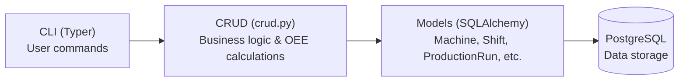
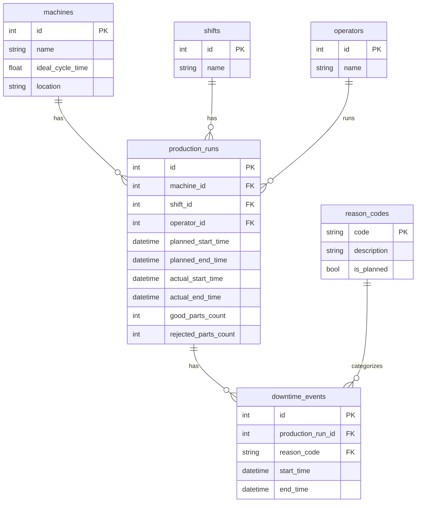

# Production Line OEE Tracker

Track Overall Equipment Effectiveness across CNC machines and shifts.

## Architecture



## Setup

```bash
# 1. Install dependencies
uv sync

# 2. Install CLI globally
uv pip install -e .

# 3. Start PostgreSQL (via Docker)
docker compose up -d

# 4. Run migrations
alembic upgrade head

# 5. Load sample data (optional)
load-sample

# 6. Use CLI
oee --help
```

## CLI Commands

```bash
# Machines
oee machine list
oee machine create "CNC-001" 30.5 --loc "Bay A"
oee machine get 1
oee machine update 1 --name "CNC-001-Updated"
oee machine delete 1

# Shifts
oee shift list
oee shift create "Day Shift"

# Operators
oee operator list
oee operator create "John Smith"

# Production Runs
oee run list
oee run create 1 1 1 "2025-01-06 06:00:00" "2025-01-06 14:00:00"
oee run start 1
oee run stop 1 500 10
oee run active

# Downtime Events
oee downtime create 1 SETUP
oee downtime stop 1
oee downtime list --run-id 1
oee downtime active

# Reports
oee report oee 1
oee report machine 1 --start 2025-01-06 --end 2025-01-10
oee report shift 1
oee report machines
oee report shifts
oee report downtime --limit 10
```

## Database



## OEE Formula

- **Availability** = Run Time / Planned Production Time
- **Performance** = (Ideal Cycle Time × Total Parts) / Run Time
- **Quality** = Good Parts / Total Parts
- **OEE** = Availability × Performance × Quality

## TODO

| Description | File | Function |
|-------------|------|----------|
| Add unique constraint on machine name | `oee_tracker/models.py` | `Machine` |
| Create migration for unique constraint | `migrations/versions/` | `alembic revision` |
| Handle IntegrityError for duplicate name on update | `oee_tracker/crud.py` | `update_machine` |
| Add is_admin column to operators | `oee_tracker/models.py` | `Operator` |
| Create migration for is_admin column | `migrations/versions/` | `alembic revision` |
| Implement is_admin check in delete_machine | `oee_tracker/crud.py` | `delete_machine` |
| Move load-sample to subcommand pattern | `oee_tracker/cli/` | `data load` |
| Add optional sort key parameter to list functions | `oee_tracker/crud.py` | `get_all_*` |
