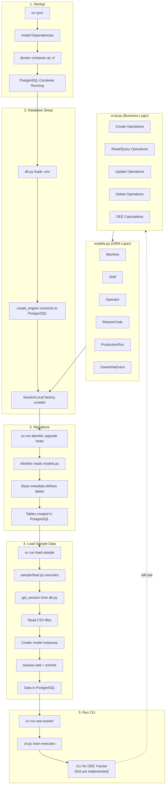

# Production Line OEE Tracker

Track Overall Equipment Effectiveness across CNC machines and shifts.

## Architecture



## Setup

```bash
# 1. Install dependencies
uv sync

# 2. Start PostgreSQL (via Docker)
docker compose up -d

# 3. Run migrations
uv run alembic upgrade head

# 4. Load sample data (optional)
uv run load-sample

# 5. Start CLI
uv run oee-tracker
```

## Database

### Tables:

Name: machines
Columns: id, name, ideal_cycle_time, location

Name: reason_codes
Columns: code, is_planned, description

Name: shifts
Columns: id, name

Name: operators
Columns: id, name

Name: production_runs
Columns: id, machine_id, shift_id, operator_id, planned_start_time, planned_end_time, actual_start_time, actual_end_time, good_parts, rejected_parts

Name: downtime_events
Columns: id, production_run_id, reason_code, start_time, end_time

## Usage

```bash
oee-tracker --help
```

## OEE Formula

- **Availability** = Run Time / Planned Production Time
- **Performance** = (Ideal Cycle Time × Total Parts) / Run Time
- **Quality** = Good Parts / Total Parts
- **OEE** = Availability × Performance × Quality